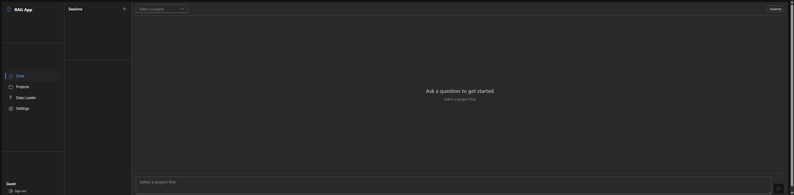
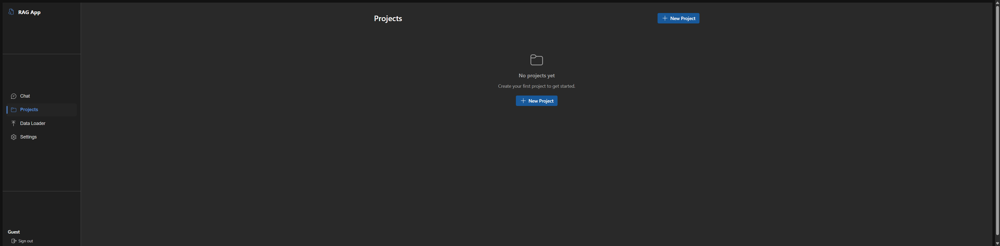
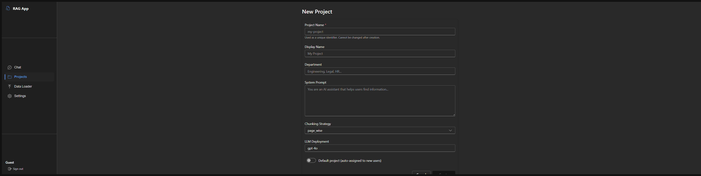
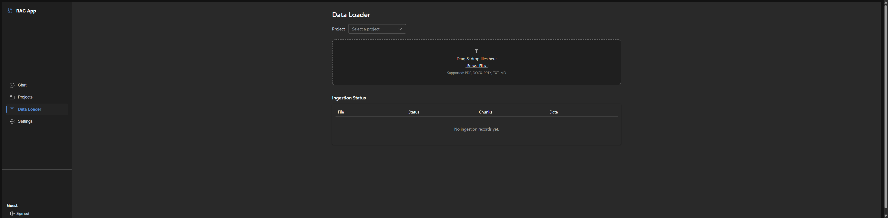
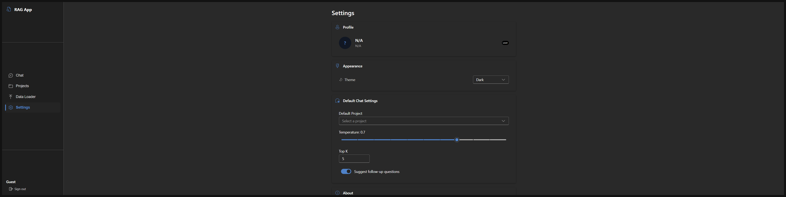
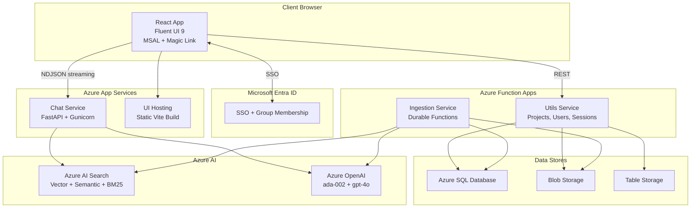

# RAG App Azure
[](https://opensource.org/licenses/MIT)

A production-grade Retrieval-Augmented Generation (RAG) application on Azure, featuring hybrid search, NDJSON streaming, MSAL SSO authentication, and a multi-service architecture for enterprise document Q&A.

## Table of Contents
- [Overview](#overview)
- [Features](#features)
- [Application Interface](#application-interface)
- [Architecture](#architecture)
- [Installation](#installation)
- [Usage](#usage)
- [Configuration](#configuration)

## Overview

RAG App Azure is a full-stack enterprise knowledge management platform that lets users upload documents, index them into Azure AI Search, and query them with natural language using GPT-4o. It combines vector search, semantic reranking, and BM25 keyword search for superior retrieval accuracy.

The system is designed for multi-tenant organizations with project-based document isolation, role-based access control, session history, and feedback tracking, all deployed on Azure with infrastructure-as-code.

## Features

- **Hybrid Search RAG**: Combines Azure AI Search vector search, BM25 keyword matching, and semantic reranking for best-in-class retrieval
- **NDJSON Streaming**: Real-time token-by-token chat responses via streaming JSON lines (not SSE)
- **Dual Authentication**: Microsoft Entra ID SSO (MSAL) for corporate users + magic link email for guest access
- **Multi-Project Isolation**: Each project has its own search index, documents, system prompt, and LLM deployment
- **Document Ingestion Pipeline**: Azure Durable Functions orchestration with support for PDF, DOCX, PPTX, TXT, MD, code files, and video/audio
- **Fluent UI 9 Frontend**: Clean Microsoft Teams-like interface with React, TypeScript, and Vite
- **Session Management**: Full chat history with save, load, and delete via Azure Table Storage
- **Feedback System**: Thumbs up/down on assistant responses for quality tracking
- **Citation Attribution**: Source document references with clickable links to original content
- **Follow-up Questions**: AI-generated follow-up suggestions after each response
- **Role-Based Access**: Admin vs user roles with conditional UI (user management page admin-only)
- **Infrastructure as Code**: Azure Bicep templates for repeatable deployment

## Application Interface

The UI is built with React 18 and Fluent UI 9, following the Microsoft Teams design language. It supports both light and dark themes with automatic system preference detection.

### Login

Centered authentication card with Microsoft Entra ID SSO and magic link email sign-in for guest access.


### Chat

Three-column layout with session history, message area with streaming responses and follow-up suggestions, and a toggleable citation panel showing source documents.



### Projects

Card grid displaying all projects with chunking strategy, LLM deployment, and default badges. Includes empty state for new deployments.



### Create / Edit Project

Form for configuring project name, department, system prompt, chunking strategy, and LLM deployment.



### Data Loader

Drag-and-drop file upload zone with project selector and ingestion status table showing per-file processing state.



### Settings

Stacked configuration cards for profile, appearance (theme toggle), default chat parameters (temperature, top-K), and application info.



## Architecture

The system uses a microservices architecture with four independent services:

### **Chat Service** (`services/chat/`)
- **FastAPI** application deployed as Azure App Service
- Hybrid search: vector + text + semantic reranker via Azure AI Search
- NDJSON streaming responses with follow-up question extraction
- Query-to-search-index routing per project
- Gunicorn + Uvicorn workers for production

### **Ingestion Service** (`services/ingestion/`)
- **Azure Durable Functions** (containerized) with orchestrator/activity pattern
- Document parsing via Azure Document Intelligence (Form Recognizer) or local Unstructured library
- Page-wise and sliding-window chunking strategies
- Embeddings via Azure OpenAI `text-embedding-ada-002`
- HyDE (Hypothetical Document Embedding) indexing option
- Audit logging per document to SQL

### **Utils Service** (`services/utils/`)
- **Azure Function App** with RESTful HTTP endpoints
- Project CRUD, user provisioning, session save/load/delete
- Feedback storage, ingestion audit queries, prompt library
- Centralized auth token validation

### **UI** (`ui/`)
- **React 18** + **Fluent UI 9** + **TypeScript** + **Vite 6**
- MSAL SSO redirect flow + magic link guest auth
- Streaming chat with citation panel, feedback buttons, follow-up suggestions
- Project management, data loader with audit table, user management (admin)
- Zero template bloat: 32 source files, ~1,780 lines total

### **Shared Library** (`services/shared/`)
- SQLAlchemy models, Azure client factories, auth middleware, config loader
- Shared across chat, ingestion, and utils services

```
rag-app-azure/
├── services/
│   ├── shared/          # Config, DB models, auth, Azure clients
│   ├── chat/            # FastAPI RAG chat service
│   ├── ingestion/       # Durable Functions document pipeline
│   └── utils/           # Azure Functions utility endpoints
├── ui/                  # React + Fluent UI 9
└── infra/               # Azure Bicep IaC templates
```



## Installation

### Prerequisites
- Python 3.10+
- Node.js 18+
- Azure CLI (`az`)
- Azure Functions Core Tools (`func`)
- An Azure subscription with these resources provisioned:
  - Azure OpenAI (with `text-embedding-ada-002` and `gpt-4o` deployments)
  - Azure AI Search
  - Azure SQL Database
  - Azure Storage Account (Blob + Table)
  - Azure App Service (for chat + UI)
  - Azure Function App (for utils + ingestion)
  - Microsoft Entra ID App Registration (for SSO)

### Setup

1. **Clone the repository:**
   ```bash
   git clone https://github.com/richie-rk/rag-app-azure.git
   cd rag-app-azure
   ```

2. **Configure environment variables:**
   ```bash
   cp .env.example .env
   # Edit .env with your Azure resource values
   ```

3. **Install backend dependencies:**
   ```bash
   # Chat service
   cd services/chat
   python -m venv venv
   source venv/bin/activate  # On Windows: venv\Scripts\activate
   pip install -r requirements.txt

   # Utils service
   cd ../utils
   pip install -r requirements.txt
   ```

4. **Install frontend dependencies:**
   ```bash
   cd ui
   npm install
   ```

5. **Set up the database:**
   ```bash
   # The shared library auto-creates tables via SQLAlchemy on first run.
   # Ensure DATABASE_URL is set in .env before starting any service.
   ```

6. **Configure frontend environment:**
   ```bash
   # Create ui/.env with frontend-specific vars
   cat > ui/.env << 'EOF'
   VITE_CHAT_API_URL=http://localhost:8000
   VITE_UTILS_API_URL=http://localhost:7071/api
   VITE_MSAL_CLIENT_ID=<your-entra-app-client-id>
   VITE_MSAL_TENANT_ID=<your-entra-tenant-id>
   VITE_MSAL_REDIRECT_URI=http://localhost:5173
   EOF
   ```

## Usage

### Quick Start

1. **Start the chat service** (run from the **repository root**, not from `services/chat/`, since the chat module uses `from services.shared.*` imports that only resolve when `services` is on the Python path as a namespace package):
   ```bash
   source services/chat/venv/bin/activate    # Windows: services\chat\venv\Scripts\activate
   uvicorn services.chat.main:app --host 0.0.0.0 --port 8000 --reload
   ```

2. **Start the utils service (separate terminal):**
   ```bash
   cd services/utils
   func start
   ```
   The ingestion service also defaults to port 7071, so if you need both running locally, start one of them with `func start --port 7072`.

3. **Start the frontend (separate terminal):**
   ```bash
   cd ui
   npm run dev
   ```

4. **Access the application:**
   - **UI**: http://localhost:5173
   - **Chat API docs**: http://localhost:8000/docs
   - **Utils API**: http://localhost:7071/api

### API Endpoints

**Chat Service** (`POST /chat`):
- Accepts `ChatRequest` with history, search_index, username, overrides
- Returns NDJSON streaming response with content deltas, data points, and follow-up questions

**Utils Service**:
| Endpoint | Method | Description |
|----------|--------|-------------|
| `/api/projects` | GET | List projects |
| `/api/projects` | POST | Create project |
| `/api/projects/:id` | PUT | Update project |
| `/api/sessions` | GET | List sessions / get messages |
| `/api/sessions` | POST | Save session |
| `/api/sessions/:id` | DELETE | Delete session |
| `/api/users` | GET | List users |
| `/api/users/provision` | POST | Provision/upsert user |
| `/api/feedback` | POST | Save feedback |
| `/api/ingest` | POST | Trigger document ingestion |
| `/api/audit/:projectId` | GET | Get ingestion audit info |
| `/api/auth/magic-link` | POST | Send magic link email |
| `/api/auth/verify` | GET | Verify magic link token |

### Deployment to Azure

```bash
# Deploy infrastructure (Bicep)
az deployment sub create --location westus3 --template-file infra/main.bicep

# Deploy chat service
cd services/chat
az webapp deployment source config-zip --resource-group <rg> --name <webapp> --src build.zip

# Deploy utils service
cd services/utils
func azure functionapp publish <function-app-name>

# Deploy UI
cd ui
npm run build
az webapp deployment source config-zip --resource-group <rg> --name <webapp> --src dist.zip
```

## Configuration

The application is fully configurable through environment variables or a `.env` file:

### Environment Variables

```bash
# Database
DATABASE_URL=mssql+pyodbc://<user>:<pass>@<server>.database.windows.net:1433/<db>?driver=ODBC+Driver+18+for+SQL+Server

# Azure OpenAI
AZURE_OPENAI_ENDPOINT=https://<resource>.openai.azure.com/
AZURE_OPENAI_API_KEY=
AZURE_OPENAI_API_VERSION=2024-10-21
DEFAULT_LLM_DEPLOYMENT=gpt-4o
EMBEDDING_DEPLOYMENT=text-embedding-ada-002
EMBEDDING_DIMENSIONS=1536

# Azure AI Search
AZURE_SEARCH_ENDPOINT=https://<service>.search.windows.net
AZURE_SEARCH_ADMIN_KEY=

# Azure Storage
AZURE_STORAGE_CONNECTION_STRING=DefaultEndpointsProtocol=https;AccountName=...
DEFAULT_BLOB_CONTAINER=documents
AZURE_TABLE_NAME=chatsessions

# Authentication
JWT_SECRET=<generate-a-strong-random-secret>
MAGIC_LINK_BASE_URL=https://<your-domain>/auth/verify
MSAL_CLIENT_ID=<entra-app-client-id>
MSAL_TENANT_ID=<entra-tenant-id>
ALLOWED_AD_GROUPS=<comma-separated-group-ids>

# Search Defaults
DEFAULT_TOP_K=10

# CORS
ALLOWED_ORIGINS=http://localhost:5173
```

### Frontend Environment Variables (ui/.env)

```bash
VITE_CHAT_API_URL=http://localhost:8000
VITE_UTILS_API_URL=http://localhost:7071/api
VITE_MSAL_CLIENT_ID=<entra-app-client-id>
VITE_MSAL_TENANT_ID=<entra-tenant-id>
VITE_MSAL_REDIRECT_URI=http://localhost:5173
```

---

Built for enterprise knowledge management on Azure.
