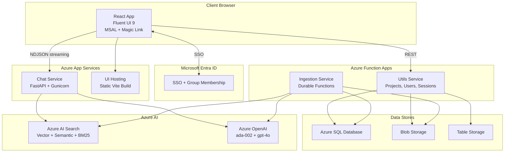

<div align="center">

# RAG App Azure

A Retrieval-Augmented Generation (RAG) app built on Azure. Upload documents and ask questions about them in natural language.


[](https://opensource.org/licenses/MIT)

</div>

> **Note:** This is a work in progress and under active development and a lot of work remaining to make it production-safe. If you spot a bug, please [open an issue](https://github.com/richie-rk/rag-app-azure/issues).

## Table of Contents

- [About the Project](#about-the-project)
  - [Screenshots](#screenshots)
  - [Tech Stack](#tech-stack)
  - [Features](#features)
- [Architecture](#architecture)
- [Getting Started](#getting-started)
  - [Prerequisites](#prerequisites)
  - [Installation](#installation)
  - [Run Locally](#run-locally)
- [Configuration](#configuration)
- [Usage](#usage)
- [Deployment](#deployment)
- [Roadmap](#roadmap)
- [Contributing](#contributing)
- [License](#license)
- [Acknowledgements](#acknowledgements)

## About the Project

The purpose of this project is to build an enterprise RAG application on Azure. It lets you upload documents and ask questions about them. Retrieval combines vector search, BM25 keyword matching, and a semantic reranker in a single Azure AI Search query, so answers stay grounded in your own content.

The app is multi-tenant at the project level. Documents are grouped into projects, and each project is mapped to its own search index, system prompt, and access list, so different groups of users can work with separate document sets in one deployment.

### Screenshots

**Login.** Microsoft Entra ID SSO and magic-link email sign-in.


**Chat.** Streaming answers with citations and follow-up suggestions, alongside a source panel.


**Projects.** A card grid of every project with its chunking strategy and LLM deployment.


**Create / Edit Project.** A form for the project name, department, system prompt, chunking strategy, and LLM deployment.


**Data Loader.** Drag-and-drop upload with a per-file ingestion status table.


**Settings.** Profile, theme, and default chat parameters.


### Tech Stack

<details>
<summary>Frontend</summary>

- React 18 and TypeScript
- Fluent UI 9
- Vite
- MSAL for Microsoft Entra ID sign-in

</details>

<details>
<summary>Backend</summary>

- Python 3.10+
- FastAPI (chat service)
- Azure Functions v2, Python (utils and ingestion)
- Azure Durable Functions (ingestion pipeline)
- SQLAlchemy

</details>

<details>
<summary>Data and AI</summary>

- Azure OpenAI (gpt-4o, text-embedding-ada-002)
- Azure AI Search (vector, BM25, semantic reranker)
- Azure SQL Database
- Azure Blob Storage
- Azure Table Storage

</details>

<details>
<summary>Infrastructure</summary>

- Azure App Service and Azure Function Apps
- Bicep templates with PowerShell provisioning scripts

</details>

### Features

- **Hybrid retrieval** that combines vector search, BM25 keyword matching, and a semantic reranker in one Azure AI Search query.
- **Streaming answers** sent as NDJSON and rendered token by token in the UI.
- **Two sign-in options**, Microsoft Entra ID SSO for organization accounts and magic-link email for guests.
- **Project isolation**, where each project has its own search index, documents, system prompt, and LLM deployment.
- **Document ingestion** through an Azure Durable Functions pipeline for PDF, DOCX, PPTX, and text-based files.
- **Chat history** saved to Azure Table Storage, with save, load, and delete.
- **Feedback** with a thumbs up or down on each answer.
- **Citations** that link answers back to their source documents.
- **Follow-up questions** suggested after each answer.
- **Role-based access**, with the user management page limited to admins.
- **Infrastructure as code** using Bicep templates and PowerShell scripts.

## Architecture

The app is made of four services (chat, ingestion, utils, and the UI) plus a shared Python library. The chat and ingestion paths are independent: ingestion writes documents and embeddings into a project's search index, and chat reads from it.



For the per-service breakdown, repository layout, and the full API reference, see [docs/architecture.md](docs/architecture.md).

## Getting Started

### Prerequisites

- Python 3.10+
- Node.js 18+
- [Azure CLI](https://learn.microsoft.com/cli/azure/) (`az`)
- [Azure Functions Core Tools](https://learn.microsoft.com/azure/azure-functions/functions-run-local) (`func`)
- An Azure subscription with: Azure OpenAI (with `gpt-4o` and `text-embedding-ada-002` deployments), Azure AI Search, Azure SQL Database, a Storage account (Blob and Table), and a Microsoft Entra ID app registration for SSO.

### Installation

1. Clone the repository:

   ```bash
   git clone https://github.com/richie-rk/rag-app-azure.git
   cd rag-app-azure
   ```

2. Install backend dependencies, ideally into a virtual environment:

   ```bash
   pip install -r services/chat/requirements.txt
   pip install -r services/utils/requirements.txt
   pip install -r services/ingestion/requirements.txt
   ```

3. Install frontend dependencies:

   ```bash
   cd ui && npm install
   ```

4. Create your `.env` file (see [Configuration](#configuration)):

   ```bash
   cp .env.example .env
   ```

The database tables are created automatically by SQLAlchemy on first run, so there is no separate migration step.

### Run Locally

Start each service in its own terminal, from the repository root.

```bash
# Chat service on port 8000. Running from the repository root keeps the
# services.shared imports resolvable as a namespace package.
uvicorn services.chat.main:app --reload --port 8000

# Utils service on port 7071
cd services/utils && func start

# Frontend on port 5173
cd ui && npm run dev
```

The ingestion service also defaults to port 7071, so run it on a different port if you need it next to utils: `func start --port 7072`.

Then open the UI at http://localhost:5173.

## Configuration

Backend settings live in a `.env` file at the repository root. Copy `.env.example` and fill in your Azure values:

```bash
# Database (SQLAlchemy connection string for Azure SQL)
DATABASE_URL=mssql+pyodbc://<user>:<pass>@<server>.database.windows.net:1433/<db>?driver=ODBC+Driver+18+for+SQL+Server

# Azure OpenAI
AZURE_OPENAI_ENDPOINT=https://<resource>.openai.azure.com/
AZURE_OPENAI_API_KEY=
AZURE_OPENAI_API_VERSION=2024-10-21
DEFAULT_LLM_DEPLOYMENT=gpt-4o
EMBEDDING_DEPLOYMENT=text-embedding-ada-002
EMBEDDING_DIMENSIONS=1536

# Azure AI Search
AZURE_SEARCH_ENDPOINT=https://<service>.search.windows.net
AZURE_SEARCH_ADMIN_KEY=

# Azure Storage
AZURE_STORAGE_CONNECTION_STRING=DefaultEndpointsProtocol=https;AccountName=...
DEFAULT_BLOB_CONTAINER=documents
AZURE_TABLE_NAME=chatsessions

# Authentication
JWT_SECRET=<a-strong-random-secret>
MAGIC_LINK_BASE_URL=https://<your-domain>/auth/verify
MSAL_CLIENT_ID=<entra-app-client-id>
MSAL_TENANT_ID=<entra-tenant-id>
ALLOWED_AD_GROUPS=<comma-separated-group-ids>

# Search defaults and CORS
DEFAULT_TOP_K=10
ALLOWED_ORIGINS=http://localhost:5173
```

The frontend reads its own variables from `ui/.env`, all prefixed `VITE_`:

```bash
VITE_CHAT_API_URL=http://localhost:8000
VITE_UTILS_API_URL=http://localhost:7071/api
VITE_MSAL_CLIENT_ID=<entra-app-client-id>
VITE_MSAL_TENANT_ID=<entra-tenant-id>
VITE_MSAL_REDIRECT_URI=http://localhost:5173
```

## Usage

With the services running, open the UI, sign in, and create a project. Upload documents on the Data Loader page, wait for ingestion to finish, then ask questions on the Chat page.

The chat service exposes one endpoint, `POST /chat`, which takes the conversation history and a target search index and returns an NDJSON stream of answer text, citations, and follow-up questions. The utils service provides the REST API behind the UI. The full endpoint list is in [docs/architecture.md](docs/architecture.md#api-reference).

## Deployment

Azure resources are provisioned with the scripts in `infra/`:

```bash
cd infra
pwsh ./provision-azure.ps1   # create all resources
pwsh ./teardown-azure.ps1    # remove them
```

After provisioning, deploy each service: a zip deploy for the chat service and the built UI, and `func azure functionapp publish` for the utils and ingestion Function Apps.

## Roadmap

- [x] Page-wise chunking
- [ ] Semantic chunking, splitting on meaning boundaries
- [ ] Recursive chunking, with configurable chunk size and overlap

Page-wise is the only chunking strategy implemented right now. I'm looking at adding semantic chunking and other options next.

## Contributing

This is a personal project and still changing. To suggest a feature or change:

1. Open an issue describing the proposal.
2. Once it has been discussed and tagged as accepted, it is ready to be picked up as a pull request.

Opening the issue first keeps the discussion on the proposal before any code gets written.

## License

Released under the MIT License. See [LICENSE](LICENSE).

## Acknowledgements

- [azure-search-openai-demo](https://github.com/Azure-Samples/azure-search-openai-demo), Microsoft's Azure-Samples RAG sample for Azure OpenAI and Azure AI Search, used as a reference while building this project.
